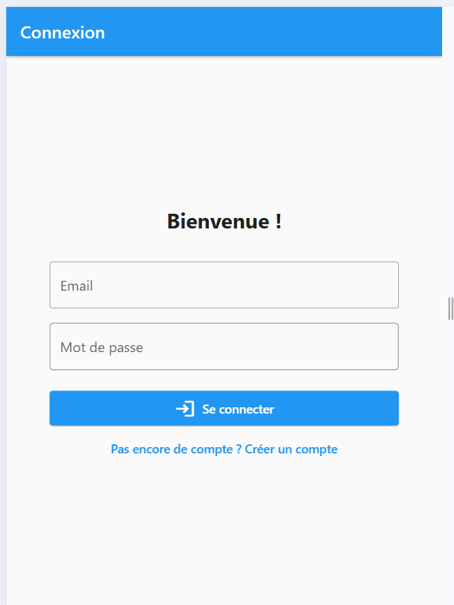
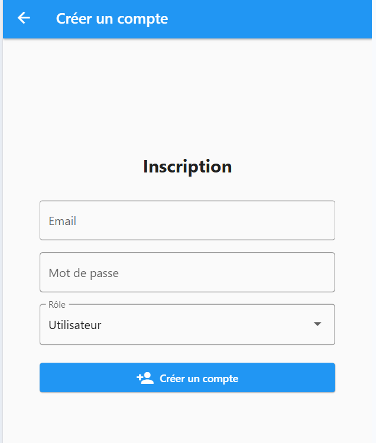
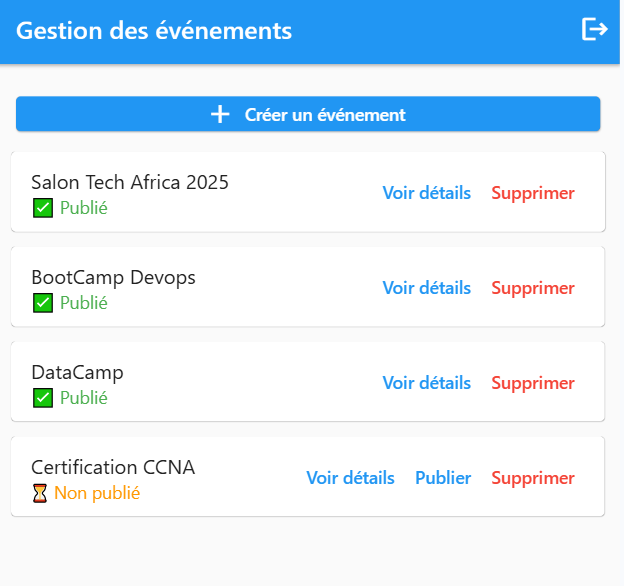
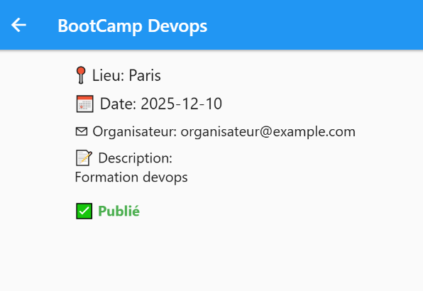

# 📅 events_frontend

**events_frontend** est une application Flutter permettant la gestion d’événements avec authentification via JWT. Elle distingue les utilisateurs selon leurs rôles (utilisateur ou organisateur) et offre des fonctionnalités adaptées à chacun.

---

## 1️⃣ Fonctionnalités principales

### Authentification
- 🔐 Connexion via JWT
- 📝 Enregistrement avec choix du rôle (`ROLE_USER` ou `ROLE_ORGANIZER`)
- 📦 Sauvegarde du token avec `SharedPreferences`
- 🚪 Déconnexion propre

### Événements
- 👁️ Voir la liste de tous les événements
- 🔍 Voir les détails d’un événement
- 🟢 Label : "✅ Publié" ou "⏳ Non publié"
- 📤 Bouton **Publier** (uniquement visible pour les organisateurs)
- ➕ Bouton **Créer un événement** (organisateurs uniquement)
- 🗑️ Supprimer un événement (organisateurs uniquement)

---

## 2️⃣ Prérequis

- [Flutter SDK](https://docs.flutter.dev/get-started/install)
- Un IDE comme Android Studio, IntelliJ ou VS Code
- Le [Backend Symfony](https://github.com/marius-kengne/events_backend.git)
- Le backend Symfony est un REST sécurisé avec JWT exposant :
  - `POST /api/login`
  - `POST /api/register`
  - `GET /api/events`
  - `POST /api/events`
  - `POST /api/events/{id}/publish`
  - `DELETE /api/events/{id}`
- s'assurer d'avoir docker et docker-compose installés

---

## 3️⃣ Installation & Lancement

```bash
# 1. Cloner et lancer le backend (plus d'infos sur le readme du backend) 
git clone https://github.com/marius-kengne/events_backend.git
cd events_backend
docker-compose up --build -d

# 2. Cloner le frontend

git clone https://github.com/marius-kengne/events_frontend.git
cd events_frontend

# 3. Installer les dépendances dans le frontend
flutter pub get

# 4. Lancer l'application le frontend
flutter run
```

> Remarque : Pour exécuter pour le **web**, assurez-vous d’exécuter :
>
> ```bash
> flutter run -d chrome
> ```

---

## 4️⃣ Configuration de l'API

Par défaut, l’URL du backend est :

```dart
static const String baseUrl = 'http://localhost:8000/api';
```

> Pour modifier cette URL, ouvrez :
>
> `lib/services/api_service.dart`  
> et changez la valeur de `baseUrl`.

---

## 5️⃣ Structure du projet

```
lib/
├── models/               # Modèles de données (Event)
├── providers/            # Provider pour l'état d'authentification
├── screens/              # Interfaces : login, register, events, détails
├── services/             # Classe ApiService pour les requêtes HTTP
└── main.dart             # Entrée principale
```

## 6️⃣ Contribution

Tu veux contribuer ? Voici comment faire :

```bash
# Crée une branche de travail
git checkout -b feature/ma-fonctionnalite

# Commit tes modifications
git commit -m "Ajoute nouvelle fonctionnalité"

# Pousse ta branche
git push origin feature/ma-fonctionnalite
```

Puis ouvre une Pull Request 🚀

---

## 📸 7️⃣ Aperçu de l’application

<h4>🟦 Écran de connexion</h4>


<h4>🟦 Écran de création de compte</h4>


<h4>🟦 Écran de création d'un événement</h4>


<h4>🟩 Liste des événements</h4>


<h4>🟨 Détails d’un événement</h4>


## 8️⃣  Ressources utiles

- [Flutter Documentation](https://docs.flutter.dev)
- [Codelab Flutter](https://docs.flutter.dev/get-started/codelab)
- [Cookbook Flutter](https://docs.flutter.dev/cookbook)
- [Symfony JWT](https://symfony.com/doc/current/security/jwt.html)

---

## 8️⃣ Licence

Distribué sous la licence **MIT**.
